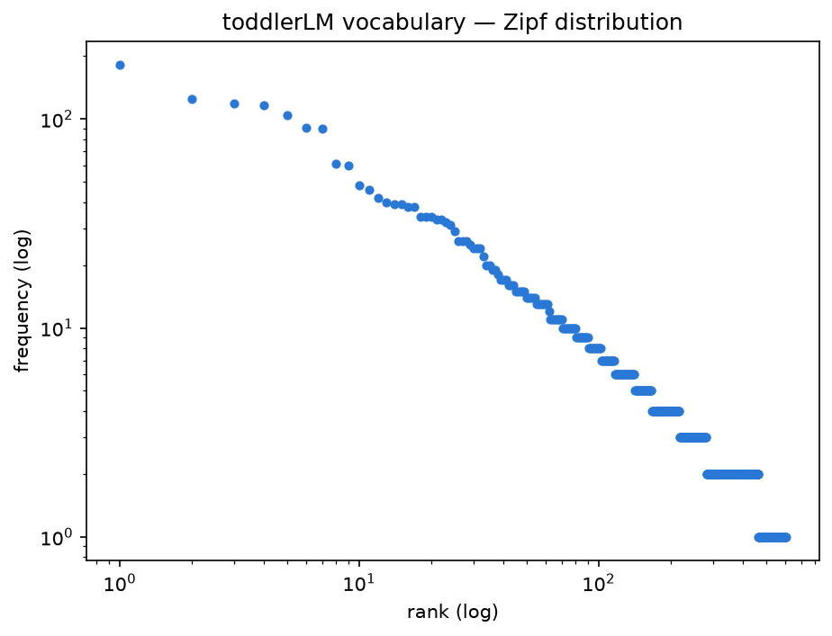

# Introduction

The goal of this project was to construct a deliberately constrained language corpus and language model to investigate 
memorisation, generalisation, corpus sparsity, linguistic categorisation and model failure modes.

## Convention: what "order" means in this codebase
Throughout the code, order = N means an N-token context (the model conditions on N previous tokens). In standard n-gram
terminology this is an (N+1)-gram — e.g. order = 3 is a 3-token context, which is a 4-gram in the literature. The naming
comes from ContextBuilder.nGram(n, ...), whose parameter is context size, not n-gram order.

## Stage 1: Corpus design

### What's the corpus? 
For my corpus, I collected utterances made by my 2-year-old daughter. These were a variety of 
phrases - questions, statements and conversations recorded over a period of two to three months. After recording the
utterance, I then wrote a caregiver response based on the scaffold of Child-Directed Speech (CDS), often known as 
Parentese. This type of speech is somewhat formulaic, it includes expansions and recasts on the child's utterance, and 
is widely used to help children develop their language skills.

### Why this project / why a hand-built corpus?
I wanted to learn about computational and corpus linguistics by building a language model with an intentionally
limited corpus, to allow for greater observability and interpretability. I wanted this project to give me insight into 
the black box of LLMs. With a tiny corpus, nothing is hidden - it is the opposite of a black box. Therefore, this
transparent toy project could help me build understanding of the opaque giants.

### How did the five categories arise? 
I did not choose the categories before building the corpus, and the categories were not derived from standard CDS 
taxonomies. I derived them inductively from the data itself. After reading through the utterances, they naturally fell 
into five groups: Information-seeking, Request and Demand, Observation, Narrative and Emotional Acknowledgement.
Information-seeking: straightforward W-? type questions, why? what? where? etc. Request and Demand: in 2-year-old
parlance these utterances were mostly of the 'I want x' variety, but essentially the child is trying to obtain or achieve
something. Emotional Acknowledgement: the child is upset and needs validation and reassurance. Observation: a fact 
typically about the child's current state or environment, anchored to the present. Narrative: these utterances are 
displaced from the present and typically based on recollections, hypothetical situations or even imaginary scenarios.
It should be noted that the scheme was developed with AI assistance, and there is no independent annotation at this point.

## Stage 2: Writing the input-response pairs

When writing the caregiver responses, there were a few rules to be applied: 
 - echo by default - the caregiver echoes the child's core message often verbatim. This is to allow for grammatical 
    expansion and implicit correction. 
 - Consistent recast fixes grammatical mistakes when echoing (e.g. ella bringed it becomes ella brought in the 
   response). However, nonsensical and imaginative utterances should not be corrected, only grammatical errors. 
 - Pronoun flip (I becomes you) so that responses make sense in the context. 
 - Contraction and capitalisation - all contractions are maintained (it's, i'm etc.) and all words are lowercased. This
   is to ensure consistency across the corpus. If the corpus contained both it's and it is or ella and Ella, the model
   would calculate these as four separate tokens instead of two tokens with two forms.
 - Reduced-form normalisation - gonna becomes going to. The actual utterance contained the word 'gonna', and although it
   is in not a grammatical error, and recasting it goes against the echo-default rule, introducing this to my already 
   tiny corpus would just create extra token fragments for no real gain.


Within the categories, a sub-style design emerged, which helped shape the responses. (To see the complete list of 
sub-styles see [Sub-style design](substyle-design.md)) For example in the Information- seeking category, sub-styles of 
I-direct and I-reflect came up. The question"is it tomorrow' is I-direct and requires a factual response. Whereas, "why 
do you work" is a potentially difficult question to answer in child-terms; by categorising it as I-reflect, the response 
can turn the question back to the child."why do you think i work" allows for a more generalised response to such questions.

Finally, when authoring the responses, there were decisions to be made about the format. Most punctuation was stripped 
since markers and context allow the model to infer rather than relying on standard punctuation. The markers used were
`<SEP>` to separate the input from the response, `<END>` to mark the end of a pair, `<EOS>` for sentence breaks, where usually
there might be a full-stop or comma. For example:

``` 
input <SEP> response1 <EOS> response2 <END>
```

## Contraction policy

Apostrophes within words were preserved to allow for negative contractions and possessives e.g. `can't`, `don't`, 
`ella's`. The contractions were preserved since this more accurately represents child speech. However, contractions such
as `it'll`, `i'd`, `george'll` were expanded (it would, i would). This was partly because contractions here can be ambiguous:
`i'd` could be either i would or i had, expanding makes it clear. Also  `'s` is expanded when a contraction of is. 
Some of these contractions read awkwardly such as `it'll`, `that'll`, and `george'll`. My daughter almost exclusively uses 
sentences such as "i don't want dinner" so these fit the policy and were preserved. The caregiver response does not 
expand or correct this to "i do not want" as this would not be linguistically natural. 

# Stage 3: Input-response generation

Up until this point, the model was still a next-token predictor, but with the child-caregiver response pairs corpus finalised, the model could conceptually shift to input-response generation. The model would be seeded with `input <SEP>` and would generate the caregiver response.

## Code changes to allow input-response generation

I had to filter `<SEP>` from prediction distributions as a control token. The model should never generate the marker in its response. During generation, the model should break out of the loop if it comes up with `<END>`. Likewise, during generation the model had to slice the generated response at `<SEP>` dropping the input and returning only the response.

## Initial probe set run (variable-order, pre-refactor)

I chose 9 utterances (8 seen and 1 unseen) as a locked probe set and tested the model against them. (N.B I later realised the weakness of this probe set. The seen inputs tested recital rather than generalisation. These initial probes are different from the 22 heldout probes I collected for stage 4).
The model generated responses that were tightly coupled to the input because the implementation at the time set the n-gram order equal to the seed length. With a seed length equal to or less than the n-gram order, the model behaves just like a lookup table. The long context is completely unique in the training data, allowing the model to find it instantly and simply return the exact word that followed it in training. As a result, backoff to a lower-order n-gram never triggers.
That was the case for seen inputs, but for unseen inputs contexts are not found at high n-gram orders and so backoff does trigger all the way down to very low orders where contexts have many continuations and the model’s response has no relation to the original context; it has become a Markov walk, generating tokens step-by-step.

## Key learning

- `<SEP>` is not a switch the model flips. It is just a token whose right-context distribution happens to encode the response-given-input mapping, because that's what training data put there. Language models have no prior concept of a conversation, it can only learn from the format of the training data. Tokens appearing before or after `<SEP>` are not intrinsically distinct from any other words, and are only linked if they fall within the same n-gram history window .

## Refactor to fixed n-gram order

Given the results of the initial probe set, I decided to refactor the model to replace the variable n-gram order with a fixed order.

## Post-refactor results at n=3
For the first test run, I set the order to n=3. This changed the model's responses significantly. The outputs recorded in `probe/test1.v3.txt` show that the model exhibits within-sub-style recombination. This means that when sampling diverged from the gold response, it tended to drift into another response in the same sub-style rather than across sub-styles. For example:

- input: `tummy hurts`, gold response: `let me rub it for you`, response: `let me have a look`. Both responses are from the E-solve sub-style.
- input: `i don't want to go to nursery`, gold response: `some days are hard`, response: `you don’t have to eat it`. Both E-normalize: the response gave a different topic, but the same register.
- input: `why do you work`, gold response: `that’s a good question`, response: `that’s a bird`. This time the model responded with I-direct rather than to I-reflect, but they share the opener `that's a`.

This is evidence that sub-style structure is implicitly encoded in n=3 statistics via the writing rules, without explicit category labels. At this point, I predicted that when I came to add category tokens to the corpus during the ablation stage, these would reinforce rather than introduce this structure.

The model was able to generate multi-sentence responses by stitching together unrelated fragments from its training data. The `<EOS>` boundary tells the model that a sentence is complete and so it drops its current context, then starts a new sentence by selecting a random token from the training data which follows a `<EOS>` marker. For example, `the duck is crying because he lost his mummy` returns `the duck is sad <EOS> why is he barking`. This demonstrates local fluency without global coherence, which is a defining property of n-gram models.


## Context Sparsity and High-Order Determinism
Looking at the results across different orders, while the higher orders were more probabilistically constrained, their sampling behaviour didn’t follow a simple 'higher order = more predictable style' pattern. At n=3, when sampling picked a token which is not the most probable continuation, the response tended to remain in the sub-style as the gold response. But at n=4, sampling could produce responses in different sub-styles. The responses for the unseen probe (`do a picture so i can grab a paper in here`) were interesting: the greedy one made most sense: `you want me to play <EOS> yes let's play`, which could plausibly follow a request to make a picture. But with sampling, although the response correctly acknowledged a request was made, it did not stick with the topic and assumed a negative emotion, when none was implied: `you want me to go away <EOS> you're cross with me <EOS> i'm going to stay here`. The model responded with R-refuse, rather than R-comply.
A possible explanation for this is distribution sparsity: at n=4 the contexts are more unique and for seen inputs the distribution has fewer options, or zero options for completely novel words in unseen probes, to choose from, which are likely very different from the most probable token. Therefore the responses can be far more varied than at n=3, which has more tokens to choose from similar to the most probable one.
This sampling behaviour is very representative of n-gram models and is a consequence of Zipf’s Law: in the corpus, a minority of contexts are encountered frequently, but the majority are unique.

At n=3, a short context such as “i want to” will sit high on the Zipf curve as lots of inputs in the training data use it. Continuations might include “go”, “do” or “play”. If sampling does not pick “go”, the other options are still plausible and stylistically similar.

At n=4, the context becomes highly unique, especially so with the unseen probe, which contains several words which do not appear in the training data. Therefore the context sits on the “long tail” of the Zipf curve, and if the model encounters a novel token (such as “grab”) it would select from the backed-off lower-order distribution, generating a response from a different sub-style.

The probe set is very small, but suggests that with further systematic testing, sampling at n=3 would produce low variance, stylistically similar responses, while n=4 would produce high variance differing-style responses.

Since the training data has a delta distribution, greedy decoding and sampling converge at n≥3. When there is typically only one possible continuation for a context, greedy will select that every time, sampling on seen probes will also always select that one continuation since choosing randomly from a distribution of one will always return that one token.

They diverge when the distributional spread is greater, which mostly occurred at n=2 or during backoff. A context such as “go to” will have many more continuations. When testing against the probe set, at n=2 one response created with sampling was quite credible. The probe `i don't want to go to nursery` produced `last time you broke your glasses at nursery <EOS> some days are hard`. This feels like a conversation, when in fact the model produced a pragmatically coherent two-sentence response by accident: the n=2 path happened to route through a topically-relevant fragment.

It should be noted that the “sampling” implementation was actually uniform random selection, treating every candidate token with equal weight, ignoring their original probabilities, unlike multinomial sampling. 

# Stage 4: Corpus statistics

### Context ambiguity by order
In this stage of the project, I began using corpus statistics to examine context ambiguity and perplexity. In the
Statistics and Perplexity modules, both the perplexity table and context-ambiguity table use "order" to represent context
size, as explained in my original conventions note. This was done deliberately because the ambiguity numbers explain the
perplexity numbers: a perplexity close to 1.0 means the model is 100% sure of the next token and has zero ambiguity -- a
deterministic context.

Context ambiguity in an n-gram model means the tokens in the context window do not have enough statistical information to
reliably predict a next token; it is too ambiguous. In this project's corpus, the majority of contexts are deterministic.
The model usually knows what token will come next. However, a few contexts are very ambiguous and have many possible
continuations or branches. The single highest-branching context in the corpus is `<SEP> you` (17 continuations at
order 2). This is the point just after a response commits to a you-acknowledgement but before it selects which kind
(want / like / feel / did / can...). This is effectively where a response category is chosen. For example, "want" becomes
Request, "like" and "did" become Observation, "feel" becomes Emotional Acknowledgement, "can" becomes Narrative. So this
single transition is the category-routing decision, in effect the most critical branch in the model's generation process.

In stage 3, I noted that the model appeared to handle sub-styles implicitly; this extreme of context ambiguity makes it
evident. This is also the point where the model's perplexity concentrates. A token generated from this 17-branch point
will carry far greater uncertainty for the model than one in the near-deterministic tokens found in the rest of the corpus.

### Vocabulary distribution: TTR, hapax proportion, Zipf plot
In my Statistics module `Statistics.vocabularyStats` and the Analysis python module, I examined the corpus, removing the
markers `<SEP>`, `<EOS>` and `<END>`, to learn about TTR, hapax and Zipf's law.

#### TTR
TTR (type-token ratio) is the number of types, or distinct words, divided by the total number of occurrences of the word
(token). If the TTR is low, this mean lots of tokens are repeated in the corpus. In my corpus, the TTR was 0.148, very
low, which reflects the formulaic nature of the data. There is a great deal of repetition, especially in the caregiver
responses.

#### Hapax
My model uses Maximum Likelihood Estimation (MLE) in the `ProbabilityBuilder.calculateProbabilities` (takes the raw count
of continuations and divides by the total). However, the corpus vocabulary shows a significant sparse-tail problem: 23%
of the word types are hapax legomena (141 of 609). This distribution exposes the vulnerability of the MLE approach, which
relies entirely on historical counts. For any hapax legomenon, MLE overfits by assigning 100% probability to its single
training context and 0% to all others, leading to coverage collapse when encountering a novel input. Kneser–Ney (KN)
smoothing would solve this issue by utilizing type-based discounting; KN leverages the lower-order
continuation probabilities of these rare words, which would ensure the model generalizes smoothly. A future iteration of
my model would certainly benefit from implementing KN.

#### Zipf's law

My corpus is broadly Zipfian, but the top of my curve is not as steep as the ideal. This is because the top types ("you",
"the", "a", "is", "i") have similar high frequencies in the corpus (182 to 104), whereas Zipf's law dictates the dropoff
from the most to the next most frequent should be sharper. The reason for this is the formulaic register; my writing rules
include pronoun flips (input "i", response "you"). Also, there are many copula templates of the form X is Y, which gives
the word "is" an elevated frequency.
Other high-ranking words were content words and their frequency encodes the taxonomy of the corpus. For example "like"
is the 8th most frequent word, which indicates the Observation category, "want" is 9th and indicates Request, "because"
is 12th and shows the causal structure that fits in Narrative.

### Per-category breakdowns
In my corpus, Information-seeking is the lexically hardest category, with the highest TTR (0.34) and highest hapax
proportion (0.45). Nearly half its response-vocabulary appears once. This reflects the factual-answer register, which
imports unique content words such as "gravity", "Tuesday" and "bulb" that are absent elsewhere, unlike the
template-driven request/emotional categories.
Based on this, I predicted that held-out information-seeking probes should carry the worst OOV and lowest coverage. In
the Python Analysis module, I drilled down into each category (`analysis/per_category_stats.py`). What I found was that
held-out OOV rate splits the categories along a formulaic-vs-content axis.

- Request (the most template-driven category) had the lowest novel-word rate (0.56): even new requests reuse the "you
  want X / let's Y" frame. My results supported my prediction: it had the lowest hapax and held-out OOV.
- Narrative and Observation are level and higher (0.69, 0.66), because new narratives and observations bring genuinely
  new content words ("aeroplanes", "ballerinas", "prize", "stingy") regardless of how repetitive
  their training vocabulary was.
- Information-seeking was untestable with exactly 1 probe. The corpus hapax stat predicts it is the hardest, but the
  held-out set did not have enough examples to prove this.

I found that Request was the category which the model handled most reliably. It does so by three independent measures:
it has the lowest corpus TTR (0.23, the most formulaic training vocabulary), the cleanest recital on the Stage 3 seen
probes, and now the lowest held-out OOV rate (0.56). These three measures seem to support my prediction.

### Cross-category bigrams (the sub-style bridges)
Cross-category bigrams are two-word sequences which appear in the responses of more than one category. They are effectively
"bridges" between sub-styles: shared phrasing that lets the model drift between sub-styles within a category during
sampling (for example the "that's a bird" instead of "that's a good question" I-direct/I-reflect drift seen in stage 3,
and the `<SEP> you` category-routing branch). If a bigram appears in many categories, it means the response is not
specific to a category.
In `analysis/category_bigrams.py` I found that several high-frequency phrases function as contentful bridges across
category boundaries. “You don't/don't like” bigrams can occur within Emotional, Observation, and Request language.
Because the original intent of the utterance cannot be reliably inferred from the transcription, these negative-preference
forms can bridge otherwise distinct categories. “let's get/get you” instantiates the recurring mirror-plus-action E-solve
template across contexts involving a fixable problem; and “you like” carries the O-like opener into adjacent categories.
Their cross-category frequency provides measured confirmation of the category bleed previously identified.

## Quantitative evaluation

After completing the generation module, I built a perplexity module to score the output of the model. The module’s main
function `responsePerplexity`, takes an input, the ‘gold response’ for the input from the corpus and the context size and
returns a score of how probable the model found that gold response.

In my test set, for an input known to the model which was entirely unique, the perplexity score was 1.0 - “after you eat
me i'll be a spoon” at context n=4. However, for an input with more than one possible continuation, “i don't want to go
to nursery” at n=4, the score was 1.23. This shows the perplexity function successfully measured distributional spread.
It showed that the model is not purely memorising: where the corpus itself has multiple valid continuations, the model
correctly reflects that spread. If the model were only memorising, it would not score anything other than 1.0 or
unscoreable.

By contrast, when feeding unseen inputs to the model, perplexity rose dramatically. At context n=4, most inputs were
unscoreable, but at n=2 I saw some inputs score a high distribution - e.g. “daddy was at the top so he can win the
prize” scored 66.1. Even at n=2, the short 2-token contexts it could find were generic, shared across many pairs, so
the distribution over continuations was wide, lowering confidence.

The unseen inputs were part of a set of 22 held-out probes gathered around five months after the initial corpus was
compiled. These probes were kept separately and not added to the training corpus. I authored a gold response for each
probe, conforming to the writing rules applied to the training corpus. Testing the model’s perplexity against this set
showed that coverage (the number of inputs which could be scored divided by the number of probes) collapses as order
rises. At n=2, coverage was 100%, n=3 59% and n=4 23%. The higher the order, the more likely a long context will
contain unseen tokens. This is corroborated by the OOV (out of vocabulary) rising with the order. This is the
generalisation cliff: not gradual degradation but a collapse into silence on novel input.

The perplexity module found that raw mean perplexity appeared to fall as order rose. However, this was evidence of
survivorship, not improvement. Since most probes were unscoreable at the highest order, the remaining short probes were
mostly generic and generated responses were memorised from training. This is why coverage, not mean perplexity, is the
honest measure of held-out performance — the perplexity mean flatters the model by averaging over an easier and easier
surviving subset.

## Stage 5: Behaviours and limitations

### Model generation

1. Recital / memorisation on seen inputs.

   When the model is fed an input which it has seen before from training, it will return the gold response near verbatim
   rather than generalising. The reason for this is, in part, the small corpus: with so few examples to learn from, most
   contexts become unique at higher n-gram orders (89% of 3-token contexts have only one continuation), so the model has
   no choice to make and reproduces the single seen response. In my tests, I saw seen-probes score perplexity 1.08-1.52
   at n=3 (converging on 1.0 at n=4). This is not strictly an error, a correct response for a seen input is a success,
   but it shows the model fits the training data exactly - analogous to overfitting - the model has no room for
   generalisation. Recital and the generalisation cliff are two sides of the same property: verbatim recall on seen
   inputs and collapse or silence on novel inputs. Relatedly, the vocabulary is sparse: 23% of word types are *hapax
   legomena* (appearing exactly once), which drives the model's brittleness on rare and unseen words.


2. Generic-attractor collapse on novel inputs.

   For totally new inputs at low n-gram orders, the model will return the same response regardless of what the input is.
   The dominant memorised response it returns starts "you want to go to the doctors...". This is because at n=2, for
   example, the model only looks at the last 2 words of the context for every generation: any preceding words fall out
   of context almost immediately. It then continues predicting the next words based only on the last 2 generated
   words. It defaults to the most common generic tokens in the training corpus, funnelling it towards the same default:
   the dominant attractor. However, at n=4, seen inputs incur recital and novel inputs become unscoreable.
   /* NB raising the order doesn't escape the low-order failure — on novel input, high-order models just back off into it
   n=8 returned seemingly nonsense, but in fact is likely the same as low-order behaviour after backoff. */

3. Local fluency without global coherence.

   The model produces seemingly coherent sentences, which are actually grammatically-correct fragments stitched together,
   such as "the duck is sad. why is he barking?". This is because an n-gram model has no discourse model, it is limited
   to just a few words of context and therefore has no overarching thematic or logical consistency.: this is a defining
   limitation of n-gram LMs.


4. Input-side leakage.

   In its current state, the model can generate grammatical errors learned from child inputs. For example “last time she
   bringed it”. This can happen whether the model uses sampling or greedy generation because the cause is structural.
   Despite inputs and responses in the corpus being separated by <SEP>, this is merely a token and is not architecturally
   enforced. The context “last time she” appears on both sides of the token and the model has no way of knowing which is
   child and which caregiver, making it possible to predict “bringed” rather than the recast “brought”. This means that
   un-recast words such as “gooder” or “buyed” are diagnostic of input-side leakage.


5. Degenerate loops.

   When using greedy generation, it is possible for the model to repeat the same tokens over and over e.g. "it's hard
   when you don't like dinner". This is greedy decoding pathology: the model chooses the highest-probability token which
   is never <END>, resulting in a generation loop. In other words, the loop is an attractor with no escape.


6. OOV / coverage failure.
   When the model encounters an entirely novel word or context, it will calculate a zero probability for next-token
   prediction, making responses unscoreable. With a tiny corpus, it is quite likely that an input might be out of
   vocabulary.


### Taxonomy

1. The taxonomy shows strain at category boundaries — utterances that sit between two categories (the flagged cases).
   These divide into two kinds. Some are resolvable: the ambiguity reflects underspecification in the scheme and could
   be fixed by tightening category definitions (e.g. how to handle justified requests). Others are irreducible: the
   deciding information — the child's internal reference — was never observable, so no amount of context resolves them
   ("kangaroos have teeth" was apropos of nothing, so it is not possible to accurately categorise the utterance). The
   first kind is a limitation of the taxonomy; the second is a limitation of working from transcribed utterances, and
   no scheme can eliminate it.

## Stage 6: Ablation


> If I give the model an explicit category signal, does it help — and if so, how much, and for which categories?

I decided to test whether adding the stage 3 category tokens to the corpus would reinforce the structure that was
already there rather than introduce new structure.
Because the structure is mostly implicit already, I'd expect explicit tokens to help modestly, and to help most
where the implicit signal is weakest — the low-frequency, high-diversity categories (information-seeking, from
my per-category stats) rather than the already-well-handled formulaic ones (request)

To test, I will supply the categories at generation time (e.g. tell the model "this is an emotional input, `<EMO>`").
This tests "does knowing the category help?"

In the future, I would like to change the model so that it can predict the category itself, as the first step of
generation. This way the model learns to classify and respond. However, I don't have time to do that right now.

### Findings:

Initially, I placed category tokens at the start of the input. However, this failed as front-placed category tokens
fall outside the context window for every scored response token, so they cannot influence the response's probability.
After this finding, I moved the category token to the end of the input, before the `<SEP>` token, allowing the category
token to appear in the context when the model generates its initial response tokens.

Perplexity results after adding category tokens at the end of inputs and before responses (before the `<SEP>` token),
showed a mixed result. Some responses scored lower perplexity, e.g. when I go high up NARR: 15.16 → 12.60.
But some went higher e.g. you have to wash your hair REQ: 8.50 → 9.60
And some made no difference e.g. wiggle wiggle jellyfish.

Increasing perplexity is caused by effectively reducing the seen contexts for a token, since the contexts are now split
into the five categories. The category token adds a token to the context preceding each response, so a context like
"`<SEP>` you", which occurred a lot in the corpus, is now split into five category-specific versions, each seen a fifth
as often.

What this suggests is that I've traded a strong generic signal for a weaker category-specific one, and whether that's a
win may depend on the category's data density.

### Ablation results:

narrative −0.59 (improved)
request −0.03 (neutral)
observation +0.67 (degraded)
emotional, information — n=1, not interpretable

### Per-category analysis

Since the findings were somewhat nuanced rather than a binary result, I will pose a new question:
> Does mean delta differ by category?

Examining each category, I wanted to see if some benefited more from category tokens than others. Categories with more
training data such as Observation and Narrative should either show improvement or remain neutral. Whereas sparse
categories or ones relying on the shared `<SEP>` context should degrade.

The results showed that there was no uniform pattern at the category level. Narrative improved slightly (−0.59), Request
was neutral (−0.03), Observation degraded (+0.67); Emotional and Information had too few held-out probes (1 each) to
interpret. The prediction that denser categories should benefit more was not supported since Observation, the densest
category, degraded.  
Instead, category tokens showed greater variance between individual probes, depending on whether a particular probe was
better supported by its category-specific context than by its generic context. As there were only around six held-out
probes per category, a small number of large probe-level changes could substantially shift the category means. A larger
held-out set would be needed to establish category-level trends.
While the results showed category tokens did not reliably improve response prediction, they did support the Stage 3
finding that sub-style structure is already implicit in the n-gram statistics. This is because the model has already
extracted category information from the corpus' lexical patterns, so an explicit category signal is mostly redundant. If
anything adding category tokens reduced the model's ability to predict a plausible next token.

## Notes

Two caveats on the findings:
- I used a very small held-out set (22 probes, ~6/category) — category means are noisy. I cannot make any strong
  conclusions about per-category trends.
- Supplying the category before generation adds a limitation to the study, since a real system wouldn't have this, but
  I already noted this as a scope decision.

## Qualitative findings

Adding category tokens to the corpus did not reliably improve gold-response prediction, but it did make a difference to
generation. Against the baseline model, the held-out probes all generated responses formed from a single dominant
memorised response - "you want to go to the doctors...". However, the tagged model responses generally matched the same
category as the input. The subject was incorrect, but the register was appropriate. The Perplexity results were
not able to detect this register-matching benefit, as it only scores the gold response.
The divergence between the quantitative and qualitative results is interesting because it points to a shortcoming in
the metrics, not just a model behaviour. 

